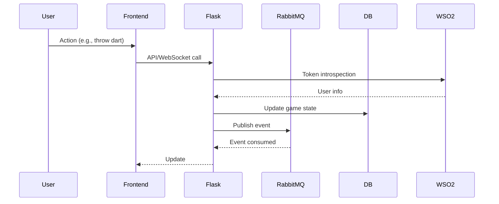

# Architecture Overview

## High-Level Architecture

```mermaid
flowchart TD
    subgraph User Layer
        P1(Player)
        GM(GameMaster)
        A(Admin)
    end
    subgraph Web Application
        F[Flask App]
        S[Socket.IO]
        G[Game Manager]
        AU[Auth (WSO2)]
        DBM[DB Models]
        RQ[RabbitMQ Consumer]
    end
    subgraph Infrastructure
        PG[PostgreSQL]
        R[ RabbitMQ ]
        W[WSO2 Server]
    end
    P1-->|HTTP/HTTPS|F
    GM-->|HTTP/HTTPS|F
    A-->|HTTP/HTTPS|F
    F-->|WebSocket|S
    F-->|Game Logic|G
    F-->|Auth|AU
    F-->|ORM|DBM
    F-->|DB|PG
    F-->|AMQP|R
    RQ-->|AMQP|R
    AU-->|OAuth2|W
```

**Components:**
- **Flask App**: Handles HTTP and WebSocket requests
- **Socket.IO**: Real-time communication
- **Game Manager**: Game logic and persistence
- **Auth (WSO2)**: OAuth2 authentication and role management
- **DB Models**: SQLAlchemy ORM for PostgreSQL
- **RabbitMQ Consumer**: Background message processing
- **PostgreSQL**: Main database
- **RabbitMQ**: Messaging queue
- **WSO2 Server**: Identity provider

## Data Flow Example


