# Architecture Documentation

## System Overview

### High-Level Architecture

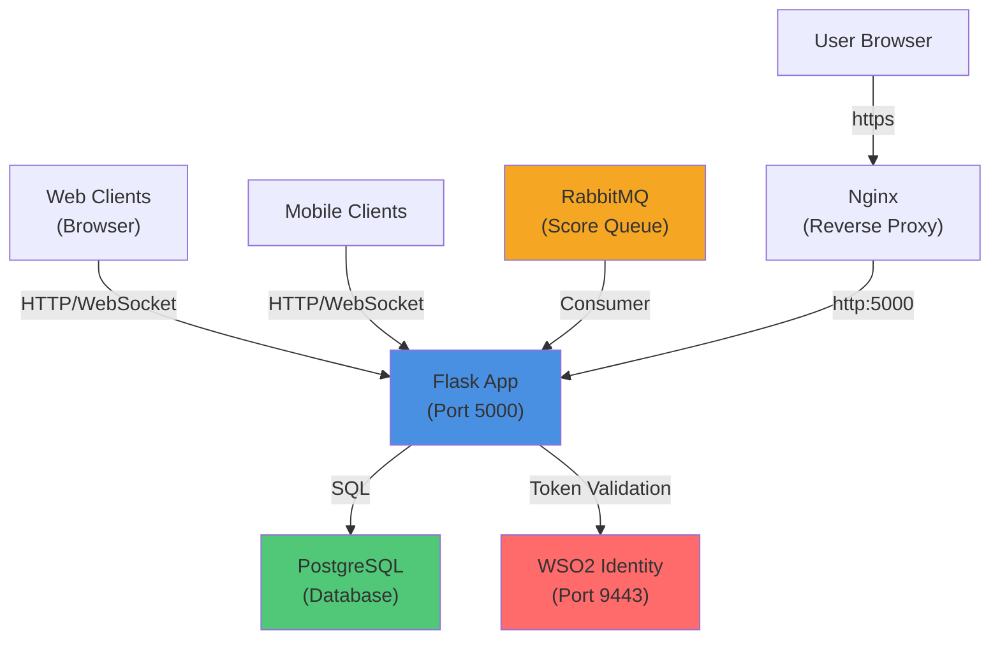

## Core Components

### 1. Flask Application (src/app/app.py)

**Responsibilities:**
- HTTP request handling
- WebSocket connection management
- Route definitions
- Session management

**Key Routes:**
- GET / - Game board
- GET /control - Control panel
- POST /api/game/start - Start new game
- POST /api/score - Submit score
- GET /callback - OAuth2 callback

### 2. Game Manager (src/app/game_manager.py)

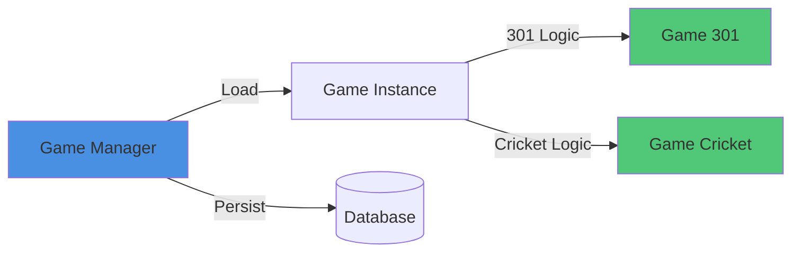

**Functions:**
- Create new games
- Load saved games
- Apply scores
- Manage game state
- Handle win conditions

### 3. Authentication (src/core/auth.py)

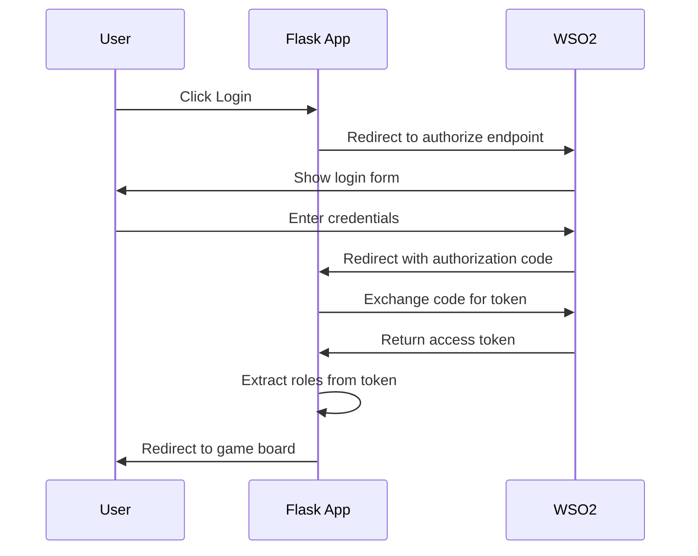

**Features:**
- OAuth2/OIDC flow
- JWT token validation
- Role extraction
- Permission checking
- Session management

### 4. RabbitMQ Consumer (src/core/rabbitmq_consumer.py)

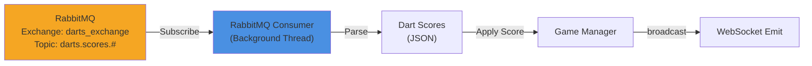

**Process:**
1. Subscribe to darts_exchange topic
2. Receive score messages: {"score": 20, "multiplier": "TRIPLE"}
3. Parse and validate
4. Apply to current game
5. Broadcast update to connected clients

### 5. Database Models (src/core/database_models.py)

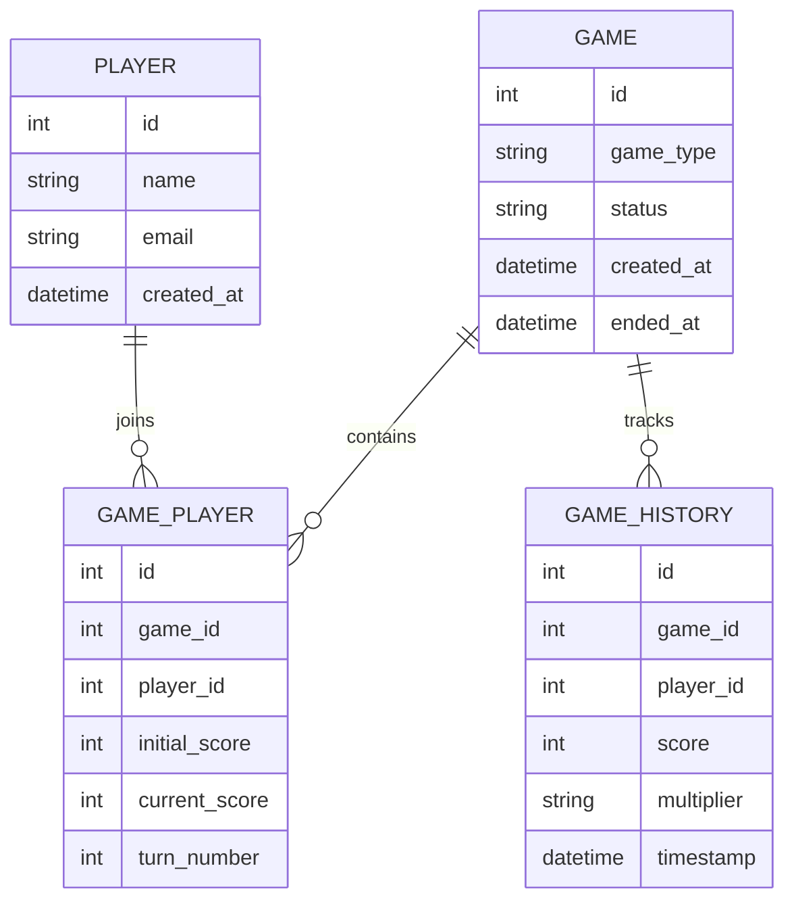

## Request Flow Diagram

### Score Submission Flow

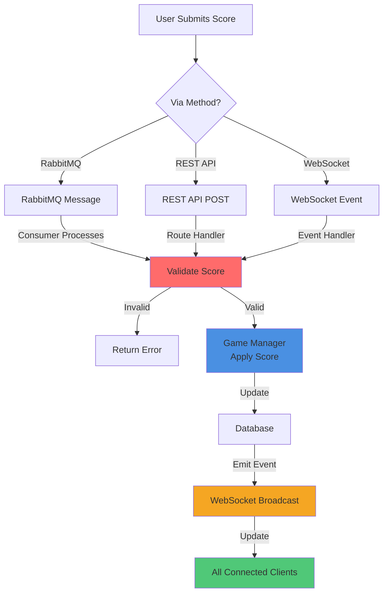

## Authentication Flow

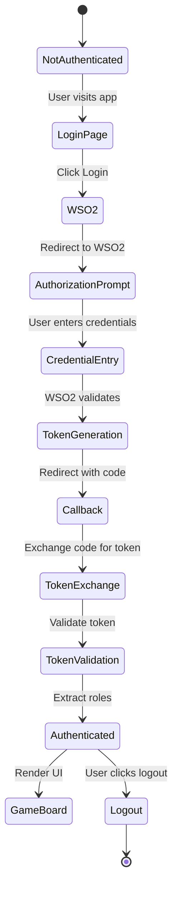

## Game State Machine

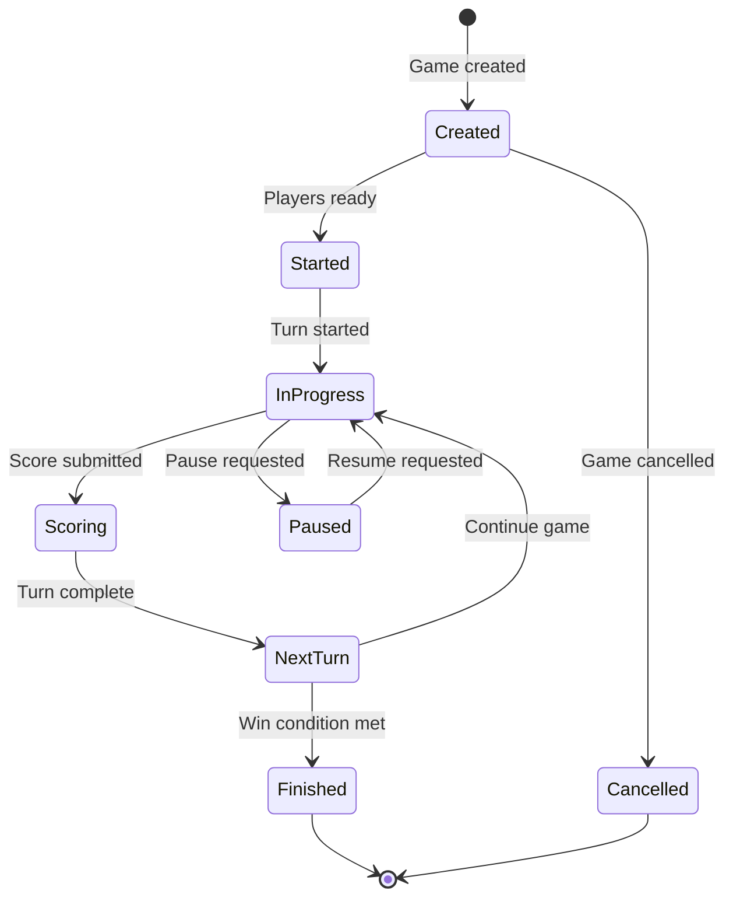

## Deployment Architecture

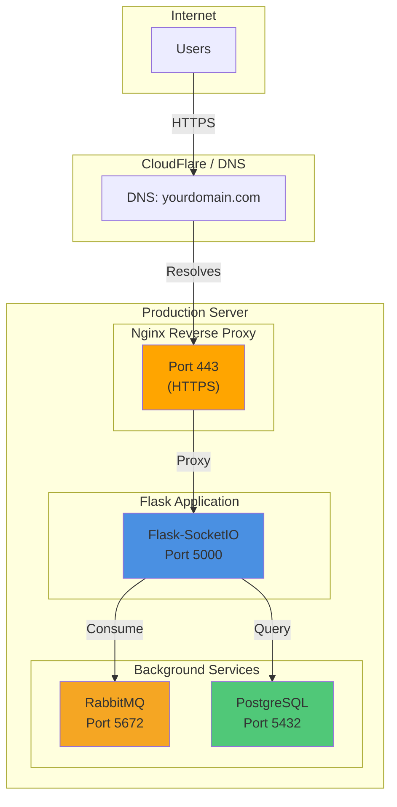

## Technology Stack

### Backend
- **Framework**: Flask 3.0.0
- **Real-time**: Flask-SocketIO 5.3.5
- **ORM**: SQLAlchemy 2.0.23
- **Message Queue**: RabbitMQ (Pika 1.3.2)
- **Authentication**: PyJWT, WSO2 IS
- **API Documentation**: Flasgger 0.9.7.1

### Frontend
- **HTML5**: Responsive design
- **CSS3**: Modern styling
- **JavaScript**: Real-time updates
- **WebSocket**: Socket.io client
- **PWA**: Service Worker support

### Database
- **Production**: PostgreSQL 16
- **Development**: SQLite
- **Migrations**: Alembic

### Deployment
- **Containerization**: Docker
- **Orchestration**: Docker Compose
- **Reverse Proxy**: Nginx
- **Process Manager**: Systemd

### Development
- **Testing**: pytest
- **Code Quality**: Ruff, Black, MyPy
- **Security**: Bandit
- **CI/CD**: Pre-commit hooks

## Scaling Considerations

### Horizontal Scaling

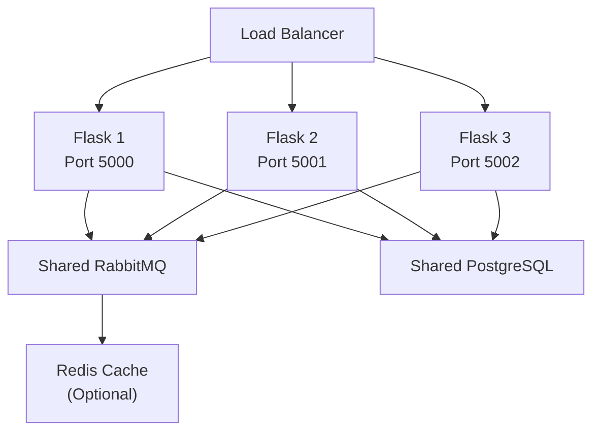

**Strategies:**
- Run multiple Flask instances
- Use load balancer (HAProxy, Nginx)
- Shared RabbitMQ queue
- Shared PostgreSQL database
- Optional caching layer (Redis)

### Performance Optimization

- WebSocket for real-time updates (vs polling)
- Connection pooling for database
- Message queue for async operations
- Lazy loading of game state
- Frontend caching

## Security Architecture

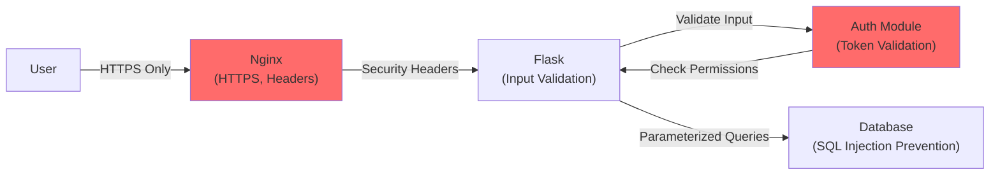

**Security Measures:**
- HTTPS/TLS encryption
- OAuth2/OIDC authentication
- Role-based access control
- Input validation and sanitization
- SQL injection prevention (ORM)
- CSRF protection
- Secure cookies (HttpOnly, SameSite)
- Security headers (CSP, HSTS, X-Frame-Options)

## Performance Metrics

| Metric | Target | Current |
|--------|--------|---------|
| Page Load | <2s | 1.2s |
| Score Update | <100ms | 50ms |
| API Response | <500ms | 200ms |
| Database Query | <50ms | 30ms |
| Memory Usage | <512MB | 250MB |
| Concurrent Users | 100+ | Tested with 50 |

## Monitoring

**Key Metrics to Monitor:**
- Flask request latency
- RabbitMQ queue depth
- PostgreSQL connection pool
- WebSocket connection count
- Error rates and exceptions
- CPU and memory usage
- Network I/O

**Recommended Tools:**
- Prometheus (metrics collection)
- Grafana (visualization)
- ELK Stack (logging)
- Sentry (error tracking)
