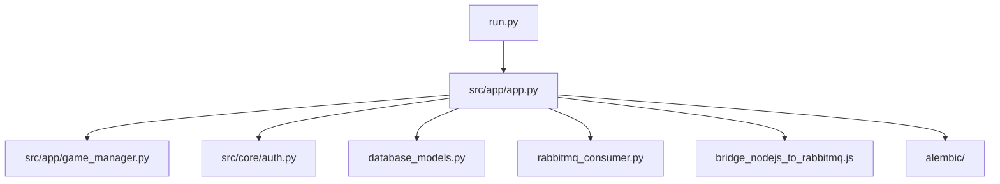

# Technical Documentation / Developer Guide

## Project Structure



- **run.py**: Entrypoint, starts Flask-SocketIO server
- **src/app/app.py**: Main app, routes, and Socket.IO events
- **src/app/game_manager.py**: Game logic and persistence
- **src/core/auth.py**: Auth decorators and WSO2 integration
- **database_models.py**: SQLAlchemy models
- **rabbitmq_consumer.py**: Background consumer for RabbitMQ
- **bridge_nodejs_to_rabbitmq.js**: Node.js bridge for messaging
- **alembic/**: DB migrations

## Key Technologies
- Flask, Flask-SocketIO, Eventlet
- SQLAlchemy (PostgreSQL)
- RabbitMQ (pika)
- WSO2 OAuth2

## Development Workflow

### Prerequisites
- Python 3.10, 3.11, or 3.12
- UV package manager (optional, for fast installs)
- Docker & Docker Compose (recommended)

### Quick Setup
```bash
make dev-setup
# or
./run.sh
```
This installs dependencies, sets up pre-commit hooks, and prepares the environment.

### Manual Setup
```bash
python3 -m venv .venv
source .venv/bin/activate
pip install -r requirements.txt
pre-commit install
```

### Testing
- Run all tests: `tox -e py311` (or `py310`, `py312`)
- Tests are in `tests/`
- Some tests require RabbitMQ running

### Linting & Formatting
- Lint: `flake8`, `mypy`
- Format: `black`

### Adding Features
- Add endpoints in `src/app/app.py`
- Add/modify models in `database_models.py`
- Update migrations as needed

### CI/CD
- Automated tests and linting run via GitHub Actions or your CI system

## Troubleshooting
- Check logs for errors
- Use Docker for consistent environments
