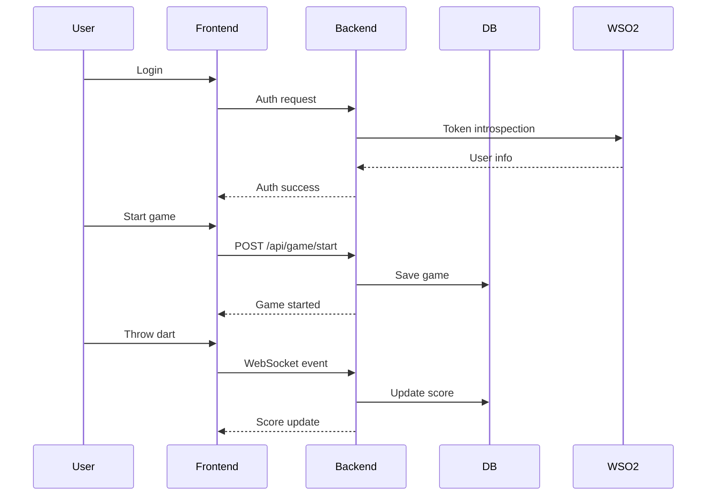

# User Guide

Welcome to the Dartserver Python Application!

## Overview
This app lets you play and manage darts games with real-time updates, user authentication, and persistent results.

## Accessing the Application

- Game Board: [http://localhost:5000](http://localhost:5000)
- Control Panel: [http://localhost:5000/control](http://localhost:5000/control)
- RabbitMQ Management: [http://localhost:15672](http://localhost:15672) (guest/guest)

## Main Features

- User authentication (OAuth/WSO2)
- Real-time game updates
- Game persistence and statistics
- REST API and WebSocket endpoints

## Getting Started

1. Log in using your credentials (OAuth/WSO2)
2. Start a new game or join an existing one
3. Play darts and track scores in real time
4. View results and statistics

## Example Game Flow

## Troubleshooting

- If you can't log in, check your token or contact admin.
- For game issues, check server logs or contact support.
